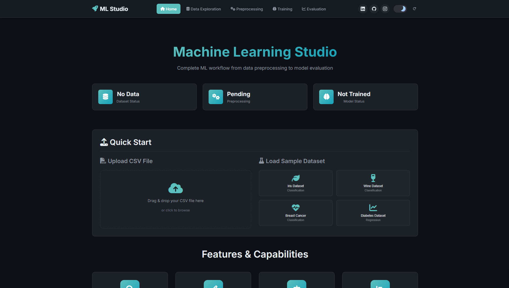

# **ML Studio v2.0**

A comprehensive web-based machine learning application for data preprocessing, model training, and evaluation with an intuitive dark/light theme interface.

<div align="center">
  <a href="https://ml-workflow-project.onrender.com/" target="_blank">
    
  </a>
</div>

<div align="center">
  
</div>



<div align="center">
  
</div>

<p align="center">
  <a href="https://youtu.be/te4OaqhCxuQ" target="_blank">
    
  </a>
</p>

<p align="center">
  <strong>▶ Watch the Demo Video</strong>
</p>


> ### **Note**: A mobile-responsive version of the ML Studio interface will be released soon to ensure a seamless experience across all devices.

## **📋 Overview**

ML Studio is a Flask-based web application that provides an end-to-end machine learning workflow:
- **Data Exploration**: Upload and analyze datasets (CSV, up to 800MB)
- **Smart Preprocessing**: Handle missing values, encode features, scale data, and balance classes
- **Auto ML Training**: Train multiple models (Random Forest, SVM, XGBoost, Neural Networks)
- **Model Evaluation**: Visualize performance with metrics, confusion matrices, and feature importance
- **Export Results**: Download preprocessed data and trained models

## **🏗️ Project Structure**

```
Preprocessing App/
├── app.py                      # Flask application (main backend)
├── requirements.txt            # Python dependencies
├── RunApp.sh                   # Quick start script (cleans + runs app)
├── clean.sh                    # Session cleanup script
├── templates/                  # HTML templates (Jinja2)
│   ├── base.html               # Base layout with navigation
│   ├── index.html              # Home page
│   ├── data_exploration.html   # Data analysis page
│   ├── preprocessing.html      # Data preprocessing page
│   ├── training.html           # Model training page
│   └── evaluation.html         # Results & evaluation page
├── static/
│   ├── css/main.css            # Styling (dark/light themes)
│   └── js/                     # Frontend JavaScript
│       ├── main.js             # Core functionality
│       ├── api.js              # API calls
│       ├── home.js             # File upload
│       ├── data-exploration.js
│       ├── preprocessing.js
│       ├── training.js
│       └── evaluation.js
├── uploads/                    # Uploaded datasets
├── session_data/               # User session data
└── flask_session/              # Flask session files
```

## **Installation**

### 1. Create Conda Environment
```bash
conda create -n deploy python=3.9.23
conda activate deploy
```

### 2. Install Dependencies
```bash
pip install -r requirements.txt
```

## **Usage**

### Quick Start (Recommended)
```bash
chmod +x RunApp.sh
./RunApp.sh
```
*Automatically cleans sessions, starts Flask, and opens browser*

### Manual Start
```bash
conda activate deploy
python app.py
```
*Then open: http://127.0.0.1:5000*

### Clean Sessions Only
```bash
chmod +x clean.sh
./clean.sh
```
*Removes all session data and temporary files*

## **📝 Notes**

- Maximum file upload size: **800MB**
- Supports CSV files with UTF-8, Latin-1, and ISO-8859-1 encodings
- Models and preprocessed data are stored in session for download
- Session data is automatically cleaned on each run (when using RunApp.sh)

## **🎯 Workflow**

1. **Upload Dataset** → 2. **Explore Data** → 3. **Preprocess** → 4. **Train Model** → 5. **Evaluate & Export**
